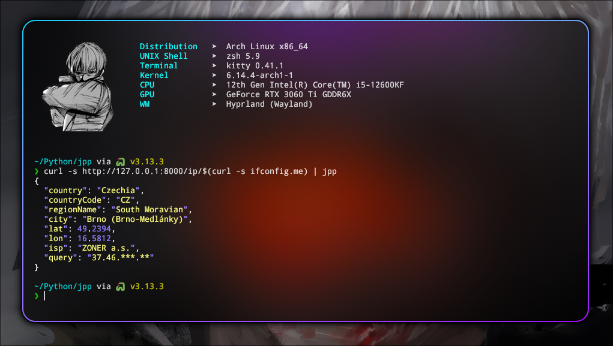

A minimalistic **JSON formatter** with colored syntax highlighting for the terminal. A simple analog of jq, tailored for clean JSON output.

---



---

## 📥 Installation

```bash
sh -c "$(curl -sS https://raw.githubusercontent.com/fabfawufawd/jpp/main/install.sh)"
```

or manually

```sh
sudo cp jpp.py /usr/local/bin/jpp && sudo chmod +x /usr/local/bin/jpp
```

---

## 🚀 Usage example

```sh
curl -s http://ip-api.com/json/$(curl -s ifconfig.me) | jpp
```
*Showing your public IP address and display it as JSON.*

---

## 🧹 Uninstall

```sh
sudo rm /usr/local/bin/jpp
```
*Simply remove the **jpp** script from your `/usr/local/bin` directory.*